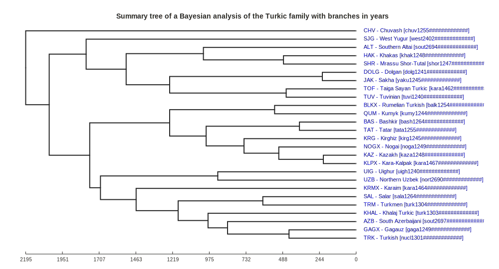

# Phlorest phylogeny derived from Hruschka et al. 2015 'Turkic (Hruschka et al. 2015)'

## How to cite

If you use these data please cite
- the original source
  > Hruschka, D. J., Branford, S., Smith, E. D., Wilkins, J., Meade, A., Pagel, M., & Bhattacharya, T. (2015). Detecting regular sound changes in linguistics as events of concerted evolution. Current Biology, 25(1), 1-9.
- the derived dataset using the DOI of the [particular released version](../../releases/) you were using

## Description

This dataset is licensed under a https://creativecommons.org/licenses/by/2.0/ license

Available online at https://doi.org/10.1016/j.cub.2014.10.064

## CLDF Datasets

The following CLDF datasets are available in [cldf](cldf):

- CLDF [Generic](https://github.com/cldf/cldf/tree/master/modules/Generic) at [cldf/Generic-metadata.json](cldf/Generic-metadata.json)

## Summary Tree

